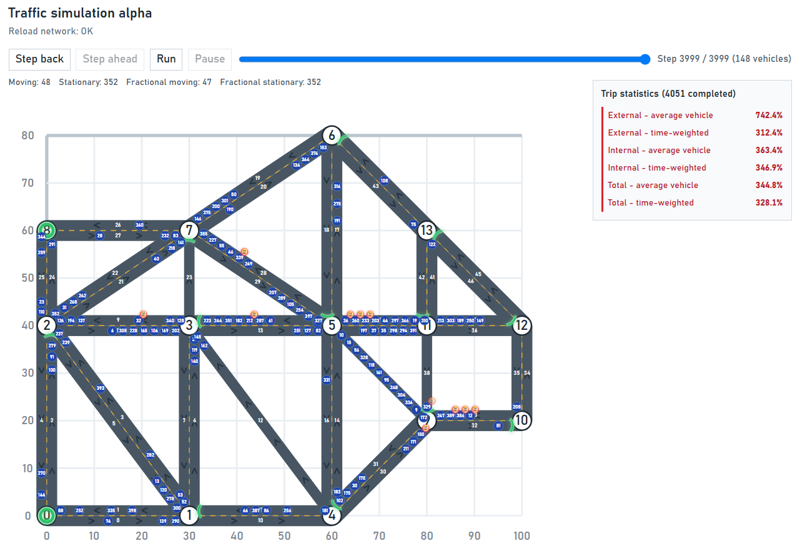
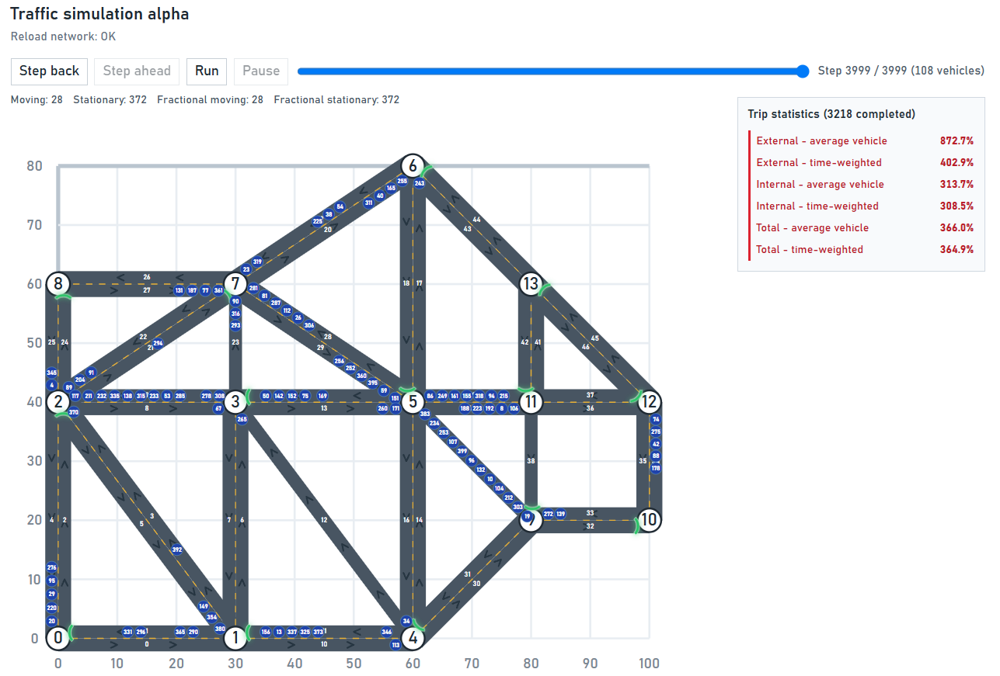

# Traffic Simulation for Adaptive Control and Reinforcement Learning

A C++20 microscopic traffic simulator built as an experimental environment for
**machine-learning and reinforcement-learning traffic-light control**. The
project first establishes deterministic, inspectable baselines: fixed-time and
connected adaptive signals. It does not claim that RL is already implemented;
instead, it provides a credible environment in which an agent can later be
trained and compared fairly.

Vehicles move through a directed city graph, obey queue spacing and signal
phases, react to blocked green movements, and may reroute when sufficiently
impatient. Every simulation step is exported to a browser visualizer, making
controller decisions and their consequences inspectable.

## Demo
<p align="center">

<br>
  <em>Figure 1. Adaptive controller (`isAdaptive = true`).</em>
</p>

<p align="center">
  
  <br>
  <em>Figure 2. Fixed-time baseline (`isAdaptive = false`).</em>
</p>

## Why this project

Traffic-light control is a sequential decision problem: a local green phase can
reduce an immediate queue while creating downstream congestion. This simulator
supports controlled comparisons among:

- fixed-time traffic lights;
- demand-aware adaptive traffic lights;
- a future RL controller acting through the same signal interface.

The trace records movement, waiting, trip-delay, signal-phase, and driver-state
data. These measurements can become RL observations and rewards, while the
non-RL controllers remain reproducible baselines.

## Current capabilities

- Directed road graph loaded from CSV, with validation of IDs, endpoints,
  lengths, and speed limits.
- Free-flow shortest paths based on road travel time (`length / speed`).
- Origin/destination demand sampling with a fixed seed for reproducible runs.
- External entry queues and per-road `deque` traffic queues with vehicle length
  and safety-gap constraints.
- Per-intersection signal phases: one external queue or one incoming road is
  green at a time.
- Static and adaptive traffic-light modes selected by
  `simulationConfig::isAdaptive`.
- Adaptive allocation based on distance-weighted detector demand, observed turn
  proportions, and estimated downstream availability.
- Individual drivers with sampled impatience thresholds and recovery behavior.
  An impatient driver may choose an available alternative road; attempted
  reroutes are remembered for the remainder of the trip.
- Browser visualizer for roads, vehicles, active phases, trip metrics, and
  impatient-driver indicators.

## Metrics

The simulator reports completed-trip delay for the external queue, internal
network, and entire trip. Each segment has two complementary aggregates:

| Metric | Formula | Meaning |
| --- | --- | --- |
| Average vehicle | `sum(actual / expected) / N` | Experience of a typical completed driver. |
| Time-weighted | `sum(actual) / sum(expected)` | Aggregate travel-time burden. |

Expected internal time is the free-flow shortest-path time. Expected external
time is based on queue headway at initialization. A value of `1.25` means the
actual time was 25% above its expected baseline.

Every frame also contains integer and fractional moving/stationary counts.
Fractional values preserve partial movement within a time step, which is useful
for later reward design (Note: when a vehicle reaches its destination, the fractional count may be lower than the integer one)

## Architecture

| Component | Responsibility |
| --- | --- |
| `main.cpp` | Configuration, validation, and simulation lifecycle. |
| `Simulation` | Vehicle movement, queues, trip statistics, and trace output. |
| `Graph` | City loading, validation, and shortest-path data. |
| `trafficLightSystem` | Signal phases, adaptive scoring, and downstream availability. |
| `simulationConfig` | Centralized parameters and validation. **Toggle `isAdaptive` here.** |
| `visualizer.html` | Interactive browser trace viewer. |

The planned RL layer will select signal phases or durations through a narrow
controller interface rather than changing vehicle-movement logic directly.

## Build and run

Requirements: CMake 3.20+, a C++20 compiler, and Python 3 for the local
visualizer server.

From the repository root:

```powershell
cmake -S . -B build
cmake --build build --config Release
.\build\Release\simulator.exe
```

For a single-config generator such as Ninja, run `./build/simulator.exe`
instead. The simulator overwrites `output/output.out`.

Then start the visualizer:

```powershell
.\start_visualizer.bat
```

Open `http://localhost:8000/visualizer.html` if it does not open
automatically. Refresh the page after generating a new trace.

## Input data

| File | Role |
| --- | --- |
| `data/intersections.csv` | Coordinates, external-entry speeds, contiguous IDs. |
| `data/roads.csv` | Directed roads: source, destination, length, speed limit, ID. |
| `data/demand.csv` | Origin and destination sampling weights. |

Road and intersection IDs are assumed to be consecutive from zero. A two-way
street is represented by two directed road records.

## Repository layout

```text
include/     Public class declarations and shared types
src/         C++ implementations and program entry point
data/        CSV city graph and demand inputs
output/      Generated simulation trace
visualizer.html
start_visualizer.bat
```

## Model scope and limitations

The current model intentionally uses one lane per directed road and one green
movement per intersection. It does not yet simulate turning lanes, pedestrians,
yellow/all-red intervals, or simultaneous non-conflicting movements.

Road processing is currently order-dependent: a vehicle may fail to enter a
road that becomes available later in the same time step. This is a known
approximation; a synchronized reservation/transfer phase is planned.

The current route precomputation is suitable for small experimental networks,
but should use priority-queue Dijkstra before large-scale city generation.

## Next steps

- Add a city generator and stronger graph/geometry validation.
- Replace order-dependent transfers with synchronized updates.
- Add automated tests for spacing, routing, trace consistency, and metrics.
- Define an RL observation/action/reward interface and benchmark it against
  the existing static and adaptive controllers.
