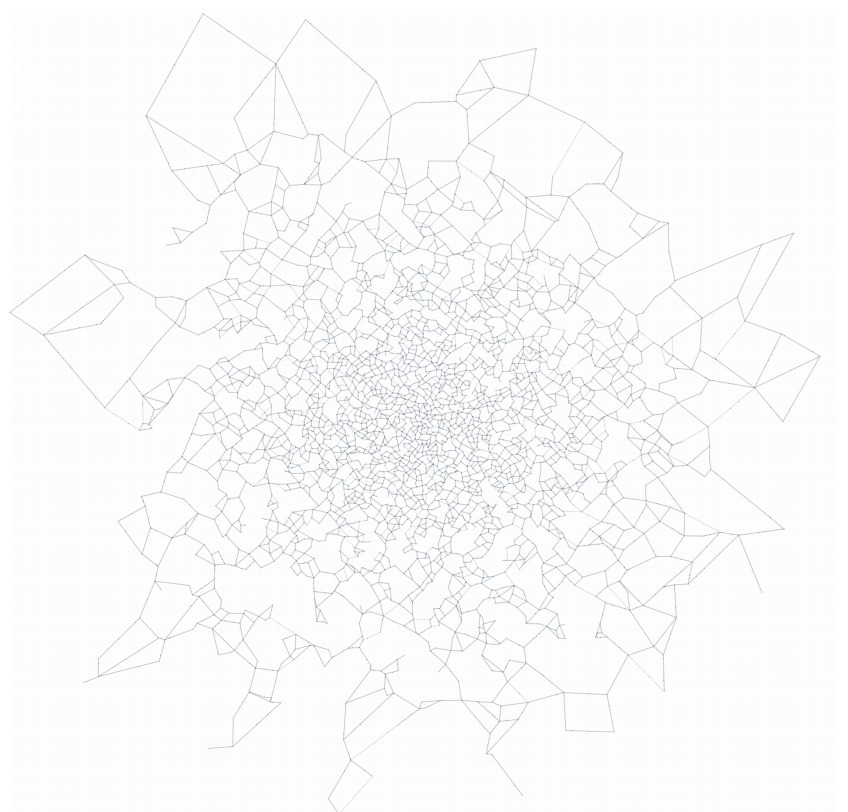
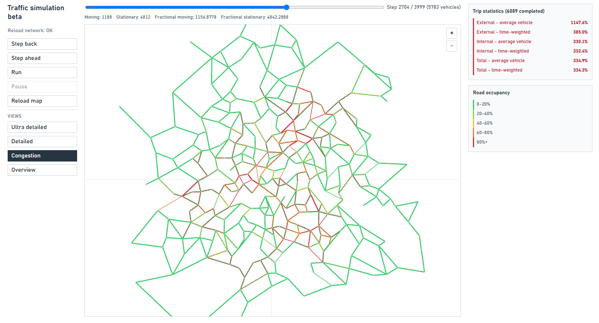

# Traffic Simulation for Adaptive Control and Reinforcement Learning

A C++20 microscopic traffic laboratory built for **machine-learning and reinforcement-learning traffic-light control**. Before an RL agent is allowed to touch the signals, the project builds the part that matters most: a city whose queues, spillback, rerouting, and congestion can be inspected step by step.

Vehicles travel through a directed city graph, keep safe spacing, obey signal phases, wait at blocked green movements, and may choose another route when impatience wins. Every step is exported to a browser visualizer, so a policy is never a black box: its decisions can be watched turning into free flow, local jams, or full gridlock.

## Demo


<p align="center">
  
  <br>
  <em>Large generated city.</em>
</p>


<p align="center">
  
  <br>
  <em>Figure 1. Adaptive controller (`isAdaptive = true`)</em>
</p>

<p align="center">
  
  <br>
  <em>Figure 2. Fixed-time baseline (`isAdaptive = false`)</em>
</p>

## Updated visualizer

<p align="center">
  
  <br>
  <em>Congestion mode</em>
</p>


## Why this project

Traffic-light control is a sequential decision problem: a local green phase can reduce an immediate queue while creating downstream congestion. This simulator supports controlled comparisons among:

- fixed-time traffic lights;
- demand-aware adaptive traffic lights;
- a future RL controller acting through the same signal interface.

The trace records movement, waiting, trip-delay, signal-phase, and driver-state data. These measurements can become RL observations and rewards, while the non-RL controllers remain reproducible baselines.

## Current capabilities

- Directed road graph loaded from CSV, with validation of IDs, endpoints, lengths, and speed limits.
- Free-flow shortest paths based on road travel time (`length / speed`), precomputed for all origins with binary-heap Dijkstra and cached as next-road and travel-time matrices.
- Origin/destination demand sampling with a fixed seed for reproducible runs.
- External entry queues and per-road `deque` traffic queues with vehicle length and safety-gap constraints.
- Dependency-aware internal-road updates: when a leader could benefit from a downstream road being processed first, roads are updated from downstream to upstream within the same time step instead of following numerical road-ID order.
- Per-intersection signal phases: one external queue or one incoming road is green at a time.
- Static and adaptive traffic-light modes selected by `simulationConfig::isAdaptive`.
- Adaptive allocation based on distance-weighted detector demand, observed turn proportions, and estimated downstream availability.
- Individual drivers with sampled impatience thresholds and recovery behavior. An impatient driver may choose an available alternative road; attempted reroutes are remembered for the remainder of the trip.
- Emergent congestion behaviour: localized queues, spillback across intersections, throughput collapse under overload, and gridlock under extreme demand.
- Versioned binary traces for aggregate statistics, per-road congestion, and detailed vehicle/signal state.
- Interactive browser visualizer with Overview, Congestion, Detailed, and Ultra detailed modes.

## Procedural city generator

`generator` creates a city instead of requiring one to be drawn by hand. It samples intersection locations with a configurable minimum separation, indexes them in a spatial grid, then uses a minimum spanning tree as a connected backbone. Additional local candidate streets are accepted only when they pass geometric intersection checks.

The generator can produce one-way and two-way streets, assign speeds from location and controlled randomness, reduce unnatural triangle density, and derive demand weights that favour departures from the outskirts and destinations near the centre. Its output is directly consumable by the simulator:

```text
data/intersections.csv
data/roads.csv
data/demand.csv
```

## Metrics

The simulator reports completed-trip delay for the external queue, internal network, and entire trip. Each segment has two complementary aggregates:

| Metric | Formula | Meaning |
| --- | --- | --- |
| Average vehicle | `sum(actual / expected) / N` | Experience of a typical completed driver. |
| Time-weighted | `sum(actual) / sum(expected)` | Aggregate travel-time burden. |

Expected internal time is the free-flow shortest-path time. Expected external time is based on queue headway at initialization. A value of `1.25` means the actual time was 25% above its expected baseline.

Every frame also contains integer and fractional moving/stationary counts. Fractional values preserve partial movement within a time step, which is useful for later reward design. When a vehicle reaches its destination, the fractional count can be lower than the integer count by design.

## Binary traces and visualizer

Each generated trace starts with a 16-byte header: four little-endian `uint32` values for magic, version, frame count, and road count. The current format version is `2`.

| File | Magic | Per-frame content | Purpose |
| --- | --- | --- | --- |
| `output/level0/statistics.bin` | `STAT` | Completed-trip aggregates, moving/stationary counts, fractional counts, and active vehicles. | Loaded first; powers Overview and the statistics panels. |
| `output/level1/congestion.bin` | `CONG` | One `float` occupancy value per directed road. | Colorizes the network in Congestion mode. Empty roads are clamped to zero occupancy. |
| `output/level2/detailed.bin` | `VEHI` | One `int32` signal phase per intersection, active vehicle count, then `{ id, roadId, positionOnRoad, impatient }` for every active vehicle. | Used by Detailed and Ultra detailed. |

`statistics.bin` currently mirrors the native C++ `statsFormat` record, so producer and viewer are intended to be built/run together on the current Windows target. The other two traces use fixed-width frame fields. The viewer validates magic values, version, expected byte length, road IDs, phase IDs, positions, and impatience flags before rendering.

### Viewer modes

| Mode | Intended use | Rendering |
| --- | --- | --- |
| Overview | Fast aggregate inspection. | Static network, coordinate axes, active-vehicle count, and trip/movement statistics; no vehicle or signal rendering. |
| Congestion | Network-level queue pressure. | Five occupancy colors, one direction arrow per road, white nodes, axes, and the occupancy legend; no vehicle IDs, traffic lights, or vehicle sprites. |
| Detailed | Lighter frame-by-frame inspection. | Road/intersection labels, one arrow per road, simplified grid, soft light-green phase markers, simple vehicles, and a red impatience dot. |
| Ultra detailed | Full debugging view. | Existing rich vehicle IDs, impatience animation, repeated direction markers, complete grid labels, and glow signal rendering. |

The page initially loads the CSV network and `statistics.bin`. `congestion.bin` and `detailed.bin` are fetched only when their mode is selected. Once loaded, the detailed trace is retained so switching between Detailed and Ultra detailed does not re-read the file.

The map supports `+`/`−` zoom controls and mouse drag panning. Camera position and zoom persist across modes. Rendering uses viewport culling in every mode: a fast road bounding-box test is followed by exact segment–viewport intersection, and only visible roads, nodes, signals, and vehicles are placed in the SVG. Zoom-out is capped at 150% of the initial camera span; zoom-in is capped at a 1 m minimum viewport span. Fullscreen adds a small vertical camera overscan to retain top/bottom context.

## Performance snapshot

Measurements below are development benchmarks on the machine used for this project, not hardware-independent guarantees.

- **Large workload, trace output disabled:** approximately **7 million vehicle updates per second**, or about **14 ms per simulation step**. The measured run used 10k intersections, about 30k directed roads, 100k simulated vehicles, and 4,000 steps (about 56 seconds without shortest-path initialization).
- **Visualizer-trace workload, all trace levels enabled:** 4,000 steps with roughly 6,000 vehicles completed in **1.05 s**. This includes statistics, congestion, and detailed vehicle/signal trace generation.

Trace serialization is batched per frame into reusable buffers: one contiguous write for congestion, signal phases, and detailed vehicles. This avoids per-record stream writes and per-frame buffer allocations.

### CPU profiling

CPU profiling was performed from Visual Studio CMake Folder View with a `RelWithDebInfo` configuration, retaining release optimizations while producing PDB symbols for readable function names. The measured CPU hot path is `Simulation::updateIntRoad` (about 41% total CPU and 35% self CPU in the profiled trace); this is vehicle-movement logic rather than trace-buffer allocation overhead.

## Architecture

| Component | Responsibility |
| --- | --- |
| `main.cpp` | Configuration, validation, and simulation lifecycle. |
| `Simulation` | Vehicle movement, queues, trip statistics, and trace output. |
| `Graph` | City loading, validation, and shortest-path data. |
| `trafficLightSystem` | Signal phases, adaptive scoring, and downstream availability. |
| `simulationConfig` | Centralized parameters and validation. **Toggle `isAdaptive` here.** |
| `cityGenerator` | Procedural planar-city generation, road geometry, and demand generation. |
| `visualizer.html` | Interactive browser trace viewer. |

The planned RL layer will select signal phases or durations through a narrow controller interface rather than changing vehicle-movement logic directly.

## Build and run

Requirements: CMake 3.20+, a C++20 compiler, and Python 3 for the local visualizer server.

From the repository root:

```powershell
cmake -S . -B build
cmake --build build --config Release
.\build\Release\simulator.exe
```

For a single-config generator such as Ninja, run `./build/simulator.exe` instead. The simulator overwrites the binary traces under `output/level0`, `output/level1`, and `output/level2`.

To create a fresh city and its demand data:

```powershell
cmake --build build --target generator --config Release
.\build\Release\generator.exe
```

Run the generator before the simulator whenever you want to replace the current city. Keep generated CSV files under version control when they represent a reproducible experiment.

Then start the visualizer:

```powershell
.\start_visualizer.bat
```

Open `http://localhost:8000/visualizer.html` if it does not open automatically. Refresh the page after generating a new trace.

## Input data

| File | Role |
| --- | --- |
| `data/intersections.csv` | Coordinates, external-entry speeds, contiguous IDs. |
| `data/roads.csv` | Directed roads: source, destination, length, speed limit, ID. |
| `data/demand.csv` | Origin and destination sampling weights. |

Road and intersection IDs are assumed to be consecutive from zero. A two-way street is represented by two directed road records.

## Repository layout

```text
include/     Public class declarations and shared types
src/         C++ implementations, simulation entry point, and city generator
data/        Generated or hand-authored city graph and demand inputs
output/      Generated binary traces: statistics, congestion, and detailed state
assets/      README screenshots and demo media
visualizer.html
start_visualizer.bat
```

## Model scope and limitations

The current model intentionally uses one lane per directed road and one green movement per intersection. It does not yet simulate turning lanes, pedestrians, yellow/all-red intervals, or simultaneous non-conflicting movements.

## Next steps

- Add more generator styles, including hierarchical arterial layouts using L-trees.
- Add automated tests for spacing, routing, trace consistency, and metrics.
- Define an RL observation/action/reward interface and benchmark it against the existing static and adaptive controllers.
- Improve visualizer by chunking data
- Strongly connected components validation for user-provided cities
